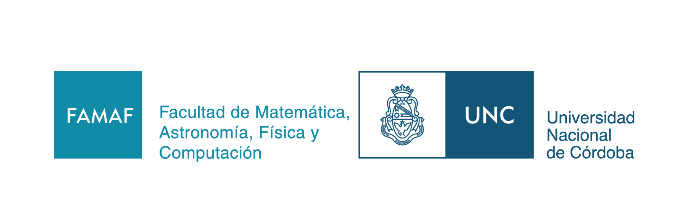

# strangelooplab
## La computadora como laboratorio filosófico: experimentos y herramientas para el modelado de sistemas reflexivos

Anexo de código del Trabajo Especial de la Licenciatura en Ciencias de la Computación en la Facultad de Matemática, Astronomía, Física y Computación (FaMAFyC)

---

### Ejecución

```
strangelooplab\models> ghci Hyperset/Main.hs
```

### Notas y organización

- [Notas del Trabajo Especial](https://www.overleaf.com/read/cpgcygtwksrf#97df54)
- [Página pública del proceso de investigación](https://shimmering-aphid-642.notion.site/Trabajo-Especial-a8317f5cf821403f82c5aafac95ee6c6?pvs=4)